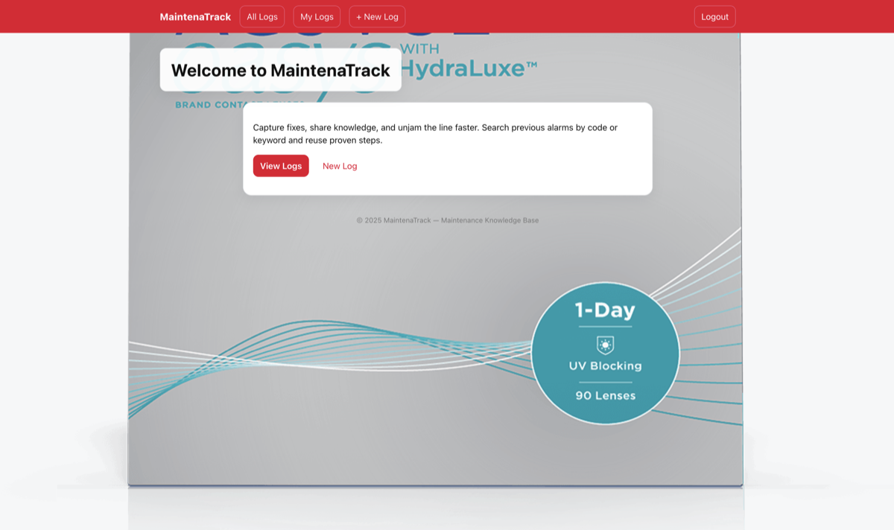

# 🔧 MaintenaTrack

**Professional Equipment Maintenance Tracking System**

MaintenaTrack is a Django 5.2 web application designed for **industrial maintenance operations** in multi-zone facilities. Built for technicians and maintenance teams to log, track, and analyze equipment maintenance activities with precision and efficiency.

<div align="center">
  <table>
    <tr>
      <td align="center">
        
        <br/>
        <em>MaintenaTrack - Professional Equipment Maintenance Tracking</em>
      </td>
    </tr>
  </table>
</div>

<br/>

<div align="center">
  <h3>📱 Multi-Device Experience</h3>
  <table>
    <tr>
      <td align="center" width="33%">
        
        <br/>
        <strong>🖥️ Desktop</strong>
        <br/>
        <small>Full dashboard & analytics</small>
      </td>
      <td align="center" width="33%">
        
        <br/>
        <strong>📱 Tablet</strong>
        <br/>
        <small>Field-optimized workflow</small>
      </td>
      <td align="center" width="33%">
        
        <br/>
        <strong>📱 Mobile</strong>
        <br/>
        <small>Quick log entry</small>
      </td>
    </tr>
  </table>
</div>

---

## 🌟 Key Features

### 📋 **Maintenance Logging**

- **Sequential step tracking** with detailed troubleshooting records
- **Alarm code management** with difficulty categorization (Easy/Medium/Hard)
- **Multi-zone support** for 22-zone industrial facilities
- **Equipment asset tracking** with auto-generated asset tags

### 🔒 **Security & Authentication**

- **Production-ready security** with enterprise-grade protection
- **User authentication** (signup, login, logout) with role-based access
- **Input validation** and sanitization for all user data
- **Rate limiting** and CSRF protection

### 📱 **Responsive Design**

- **Mobile-optimized** interface for field technicians
- **Tablet-friendly** layout for maintenance supervisors
- **Desktop experience** for detailed analysis and reporting
- **Cross-platform compatibility** - works on any modern browser

### 🔍 **Advanced Filtering & Search**

- **Full-text search** across logs, descriptions, and troubleshooting steps
- **Zone-based filtering** for location-specific maintenance
- **Difficulty level categorization** for workload planning
- **User-specific log filtering** for personal activity tracking

### 🚀 **Production Ready**

- **Docker containerization** for consistent deployment
- **Environment-based configuration** for multiple deployment stages
- **Comprehensive logging** and error handling
- **Static file optimization** with WhiteNoise middleware

---

## 📱 Multi-Device Experience

| Device Type    | Optimized Features                                                       |
| -------------- | ------------------------------------------------------------------------ |
| 📱 **Mobile**  | Quick log entry, barcode scanning ready, touch-friendly interface        |
| 📟 **Tablet**  | Split-view forms, enhanced equipment selection, field-optimized workflow |
| 🖥️ **Desktop** | Full dashboard, detailed analytics, comprehensive equipment management   |

---

## 🛠️ Technology Stack

- **Backend**: Django 5.2.6, Python 3.12+
- **Database**: SQLite (development), PostgreSQL/MySQL (production ready)
- **Frontend**: Responsive HTML5, CSS3, Vanilla JavaScript
- **Security**: HTTPS, HSTS, secure headers, input validation
- **Deployment**: Docker, Gunicorn, WhiteNoise
- **Documentation**: Sphinx, comprehensive API docs

---

## 📦 Quick Start

### 🔧 **Local Development Setup**

```bash
# Clone the repository
git clone https://github.com/Luwieza/maintenatrack-v1.0.git
cd maintenatrack-v1.0

# Set up Python virtual environment
python3 -m venv .venv
source .venv/bin/activate   # On Windows: .venv\Scripts\activate

# Install dependencies
pip install -r requirements.txt

# Run database migrations
python manage.py migrate

# Create superuser (optional)
python manage.py createsuperuser

# Start development server
python manage.py runserver
```

Visit `http://127.0.0.1:8000` to access the application.

### 🐳 **Docker Development**

```bash
# Build and run with Docker Compose
docker-compose up --build

# Access the application
open http://localhost:8000
```

### 🚀 **Production Deployment**

```bash
# Copy environment template
cp .env.example .env

# Generate production secret key
python -c 'from django.core.management.utils import get_random_secret_key; print(get_random_secret_key())'

# Edit .env with your production values
# Then run with production settings
python manage.py runserver --settings=maintenatrack.settings_prod
```

See `DEPLOYMENT_SECURITY.md` for comprehensive production deployment guide.

---

## 📊 Project Structure

```
maintenatrack/
├── 📁 maintenance/          # Core application
│   ├── 📄 models.py        # Data models (Equipment, MaintenanceLog, Step)
│   ├── 📄 views.py         # Business logic and controllers
│   ├── 📄 forms.py         # Form handling and validation
│   ├── 📄 admin.py         # Django admin configuration
│   └── 📁 templates/       # HTML templates
├── 📁 maintenatrack/       # Project settings
│   ├── 📄 settings.py      # Development settings
│   ├── 📄 settings_prod.py # Production settings
│   └── 📄 urls.py          # URL routing
├── 📁 static/              # Static assets (CSS, JS, images)
├── 📁 docs/                # Sphinx documentation
├── 📄 requirements.txt     # Python dependencies
├── 📄 Dockerfile           # Container configuration
└── 📄 docker-compose.yml   # Multi-container setup
```

---

## 🎯 Use Cases

### 👷 **Field Technicians**

- Log maintenance incidents on mobile devices
- Record step-by-step troubleshooting processes
- Track time spent on each maintenance step
- Access equipment history in the field

### 👨‍💼 **Maintenance Supervisors**

- Monitor team productivity and workload
- Analyze maintenance patterns and trends
- Generate reports for management
- Manage equipment inventory and locations

### 🏭 **Facility Managers**

- Overview of all maintenance activities
- Zone-based maintenance scheduling
- Cost analysis and resource planning
- Compliance and audit trail management

---

## 🔧 Core Workflow

1. **🚨 Incident Detection** - Technician receives alarm or identifies issue
2. **📝 Log Creation** - Create new maintenance log with alarm code and zone
3. **🔍 Troubleshooting** - Record sequential steps with actions and results
4. **⚙️ Equipment Link** - Associate with specific equipment (optional)
5. **✅ Resolution** - Mark completion with difficulty assessment
6. **📊 Analysis** - Search, filter, and analyze maintenance patterns

---

## 🤝 Contributing

We welcome contributions! Please see our contributing guidelines:

1. **Fork** the repository
2. **Create** a feature branch (`git checkout -b feature/amazing-feature`)
3. **Commit** your changes (`git commit -m 'Add amazing feature'`)
4. **Push** to the branch (`git push origin feature/amazing-feature`)
5. **Open** a Pull Request

---

## 📖 Documentation

- **📚 [API Documentation](docs/build/html/index.html)** - Comprehensive code documentation
- **🔒 [Security Guide](DEPLOYMENT_SECURITY.md)** - Production security checklist
- **⚙️ [Configuration](maintenatrack/settings_prod.py)** - Environment settings
- **🏗️ [Architecture](.github/copilot-instructions.md)** - System design and patterns

---

## 📄 License

This project is licensed under the MIT License - see the [LICENSE](LICENSE) file for details.

---

## 📞 Support

- **Issues**: [GitHub Issues](https://github.com/Luwieza/maintenatrack-v1.0/issues)
- **Documentation**: [Project Wiki](https://github.com/Luwieza/maintenatrack-v1.0/wiki)
- **Email**: support@maintenatrack.com

---

<div align="center">

**Built with ❤️ for Industrial Maintenance Teams**

[](https://djangoproject.com/)
[](https://python.org/)
[](https://docker.com/)
[](DEPLOYMENT_SECURITY.md)

</div>
